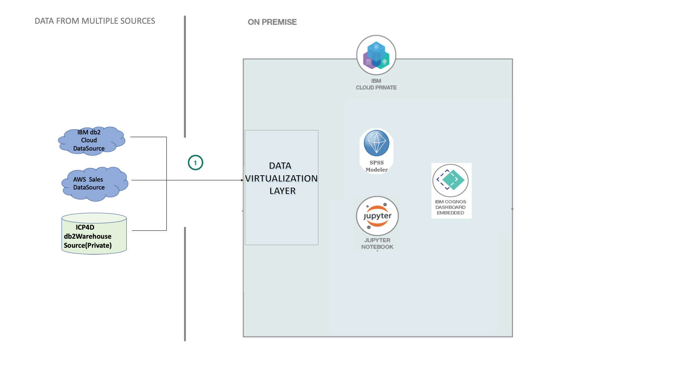

# Effective Inventory and Dynamic Pricing Management using ICP for D

Dynamic pricing is an approach to setting the cost for a product or service that is highly flexible. The goal of dynamic pricing is to allow a company that sells goods or services to adjust prices on the fly in response to demand and supply.

In this code pattern, we will create a dynamic pricing and stock optimization model on IBM Cloud Private leveraging Data IBM SPSS Modeler and collecting Data from Sources like AWS, Db2 Cloud and Db2 WH on ICP4D.

The output is on the Embedded Dashboard Service hosted in ICP for D, having the following views:

* Give business insights on the current movement of the supply chain.
* Give a Dynamic Price for the product based on Seasonality factors.
* Stock in Inventory ( Effective Inventory Management)- Based on a Time-Series Model.
* The flow of Products- In Terms of the Seasonality.

